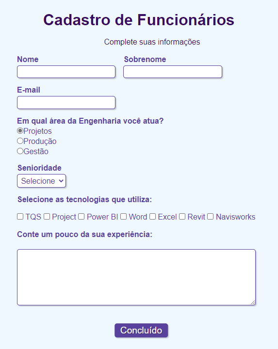

  <a href="#rocket-tecnologias">Tecnologia</a>&nbsp;&nbsp;&nbsp;|&nbsp;&nbsp;&nbsp;
  <a href="#-projeto">Projeto</a>&nbsp;&nbsp;&nbsp;|&nbsp;&nbsp;&nbsp;
  <a href="#-como-rodar">Como rodar</a>&nbsp;&nbsp;&nbsp;|&nbsp;&nbsp;&nbsp;
  <a href="#-como-contribuir">Como contribuir</a>&nbsp;&nbsp;&nbsp;
  

 

 

  

## Criação de formulário de cadastro utilizando HTML e CSS

## 🚀 Tecnologias

Esse projeto foi desenvolvido com as seguintes tecnologias:

- [html5](https://html.spec.whatwg.org/)
- [css](https://www.w3.org/Style/CSS/)

## 💻 Projeto

O Cadastro de Funcionários é um formulário para pré-seleção de profissionais.

## 👩🏿‍💻 Como rodar

- Clone o projeto.
- Abra o arquivo html no seu navegador.

## 🤔 Como contribuir

- Faça um fork desse repositório;
- Cria uma branch com a sua feature: `git checkout -b minha-feature`;
- Faça commit das suas alterações: `git commit -m 'feat: Minha nova feature'`;
- Faça push para a sua branch: `git push origin minha-feature`.

Depois que o merge da sua pull request for feito, você pode deletar a sua branch.

